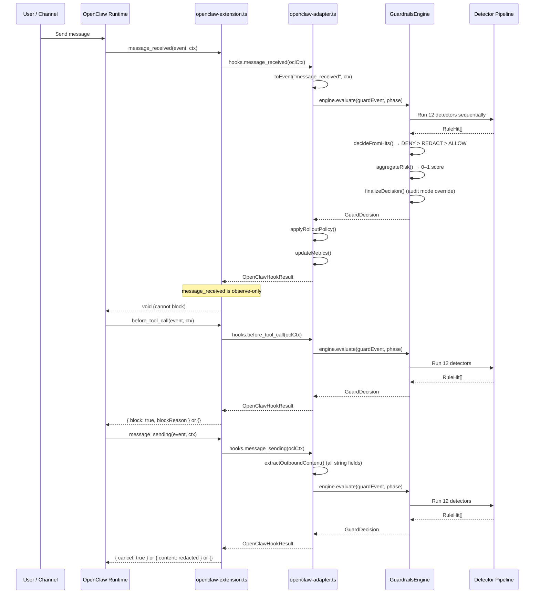
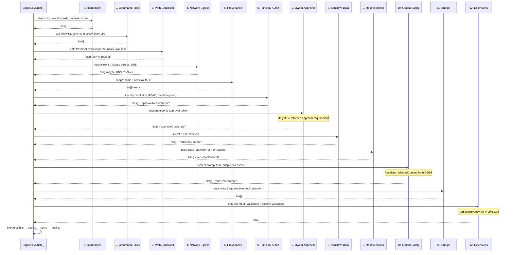
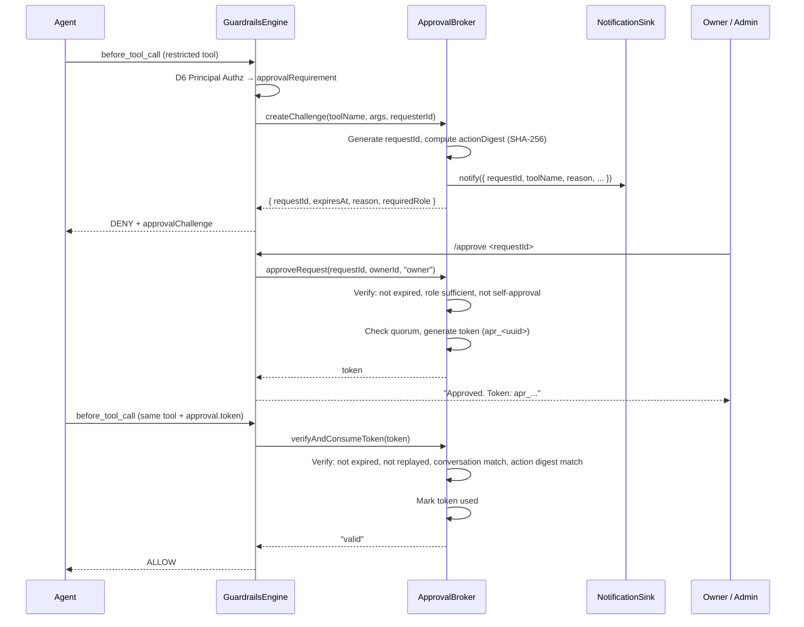

# SafeFence

[](https://www.npmjs.com/package/@safefence/openclaw-guardrails)
[](https://docs.npmjs.com/generating-provenance-statements)
[](https://github.com/douglasswm/safefence/actions/workflows/publish.yml)

> **Experimental** -- This project is under active development and not yet production-ready. APIs, config schemas, and behavior may change without notice between releases.

Security-focused tooling for hardening OpenClaw agent deployments, with emphasis on OWASP LLM Top 10 controls, deterministic guardrails, and multi-user safety.

## Repository Layout

- `packages/openclaw-guardrails`: production TypeScript guardrails library/plugin.
- `docs/openclaw-llm-security-research.md`: threat research, OWASP mapping, and hardening guidance.
- `docs/rbac-research.md`: RBAC and adaptive guardrails strategic framework.
- `CLAUDE.md`: local engineering workflow and coding standards.

## What This Project Delivers

A deterministic security plugin for OpenClaw agents — no remote inference, zero runtime dependencies. Current version: `0.6.2`.

### Detection Pipeline
- Fixed-order detector pipeline (12 detectors): input intent (prompt injection, exfiltration, context probing), command policy, path canonicalization, network egress, supply chain provenance, principal authorization, owner approval, sensitive data, restricted-info redaction, output safety, budget enforcement, and external/custom validators.
- Monotonic precedence: `DENY > REDACT > ALLOW`.

### Identity and Access Control
- Principal-aware authorization (`owner/admin/member/unknown`) with anti-spoofing.
- Group-aware mention-gating and role-based tool policy.
- Owner-approval workflow with TTL, anti-replay, conversation binding, and optional persistence.
- Admin notification bridge for approval workflow alerts.

### Extensibility
- Immutable JSONL audit trail for every evaluation.
- Custom business rule validators for domain-specific logic.
- Optional external HTTP validators with circuit breaker (e.g. Guardrails AI).
- Per-user token usage tracking with JSONL persistence.

### Operational Controls
- Staged rollout (`stage_a_audit`, `stage_b_high_risk_enforce`, `stage_c_full_enforce`).
- Runtime monitoring snapshot with false-positive threshold signaling.
- Fail-closed by default.
- 112 tests across 19 test files at ~85% line coverage.

## How It Works

### End-to-End Flow

Every agent lifecycle event passes through the guardrails plugin before reaching the agent or the user.



### Detector Pipeline

All 12 detectors run sequentially for every evaluation. No short-circuiting — an early DENY does not skip later detectors.



### Owner Approval Workflow



## Quick Start (Current Package)

```bash
cd packages/openclaw-guardrails
npm install
npm test
npm run test:coverage
npm run build
```

## Release Workflow

Releases are published automatically via GitHub Actions with [npm provenance](https://docs.npmjs.com/generating-provenance-statements). Every published version includes a Sigstore-signed attestation linking the package to the exact source commit and CI workflow.

```bash
cd packages/openclaw-guardrails

# 1. Bump version (runs tests, builds, syncs all version references, commits, tags)
npm version patch   # or: npm version minor | npm version major

# 2. Push to GitHub — CI publishes to npm with provenance
git push origin master --tags

# 3. Verify provenance
npm audit signatures
```

`npm version` automatically: runs tests, builds, syncs the version to `openclaw.plugin.json`, `src/plugin/version.ts`, and the root `README.md`, then commits and tags. The publish workflow (`.github/workflows/publish.yml`) handles `npm publish --provenance` using GitHub OIDC — no manual signing keys required.

Ensure `package.json` has `openclaw.extensions` pointing to `./dist/plugin/openclaw-extension.js`, and the tarball includes `dist/**`, `openclaw.plugin.json`, and `README.md`.

## Documentation

- Package docs: [`packages/openclaw-guardrails/README.md`](./packages/openclaw-guardrails/README.md)
- Research report: [`docs/openclaw-llm-security-research.md`](./docs/openclaw-llm-security-research.md)
- RBAC research: [`docs/rbac-research.md`](./docs/rbac-research.md)

## Compatibility

- OpenClaw target: `>=2026.2.25`
- Node.js: `>=20`
- TypeScript: `5.x`
