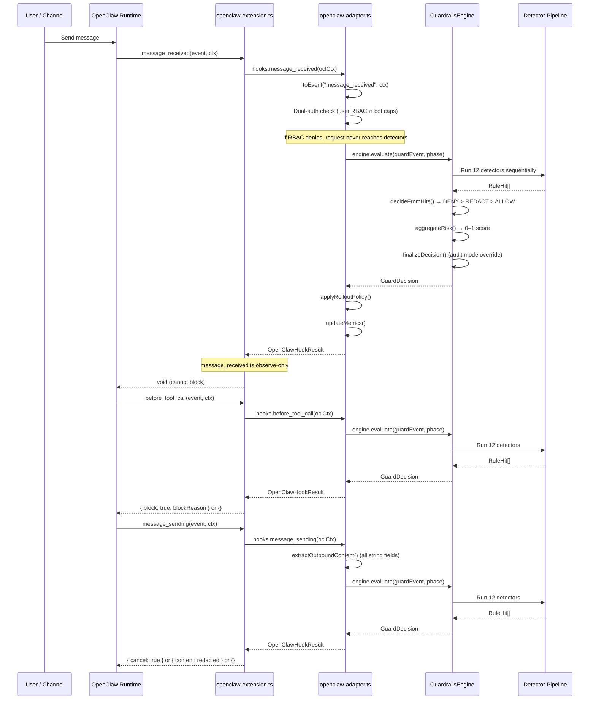
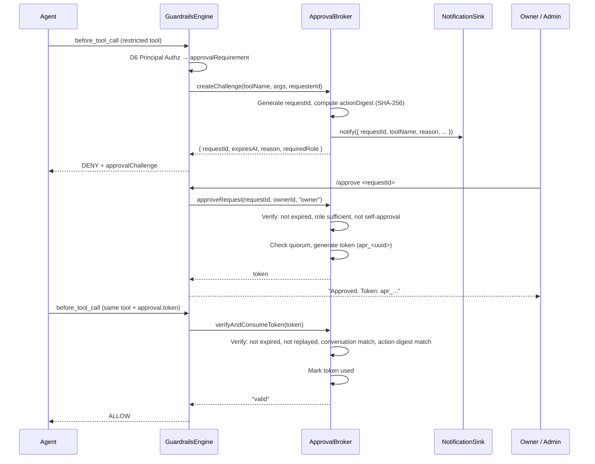

# SafeFence

[](https://www.npmjs.com/package/@safefence/openclaw-guardrails)
[](https://docs.npmjs.com/generating-provenance-statements)
[](https://github.com/douglasswm/safefence/actions/workflows/publish.yml)

> **Experimental** -- This project is under active development and not yet production-ready. APIs, config schemas, and behavior may change without notice between releases.

Security-focused tooling for hardening OpenClaw agent deployments, with emphasis on OWASP LLM Top 10 controls, deterministic guardrails, and multi-user safety.

## Repository Layout

- `packages/openclaw-guardrails`: production TypeScript guardrails library/plugin.
- `packages/control-plane`: centralized control plane API (Hono + PostgreSQL + Redis).
- `packages/dashboard`: Next.js admin dashboard for policy, RBAC, fleet, and audit management.
- `docs/openclaw-llm-security-research.md`: threat research, OWASP mapping, and hardening guidance.
- `docs/rbac-research.md`: RBAC and adaptive guardrails strategic framework.
- `CLAUDE.md`: local engineering workflow and coding standards.

## What This Project Delivers

A deterministic security plugin for OpenClaw agents — no remote inference, zero runtime dependencies. Now with optional centralized control plane for multi-instance fleet management. Current version: `0.8.0`.

### Detection Pipeline
- Fixed-order detector pipeline (12 detectors): input intent (prompt injection, exfiltration, context probing), command policy, path canonicalization, network egress, supply chain provenance, principal authorization, owner approval, sensitive data, restricted-info redaction, output safety, budget enforcement, and external/custom validators.
- Monotonic precedence: `DENY > REDACT > ALLOW`.

### Identity and Access Control
- Dual-authorization model (user RBAC ∩ bot capabilities) with anti-spoofing.
- Persistent RBAC store (SQLite) with per-user, per-bot, per-channel role assignments.
- Bot instances as first-class entities with capability ceilings and access policies.
- Bot commands (`/sf`), HTTP admin API, and CLI for dynamic role management without restart.
- Zero-config bootstrap: `/sf setup` claims first ownership without config file edits.
- Dynamic RBAC role resolution: store-first lookup before config fallback.
- Group-aware mention-gating and role-based tool policy.
- Owner-approval workflow with TTL, anti-replay, conversation binding, and optional persistence.
- Admin notification bridge for approval workflow alerts.

### Extensibility
- Immutable JSONL audit trail for every evaluation.
- Runtime policy store: 22 config fields changeable via `/sf policy set` without restart, persisted in SQLite.
- Custom business rule validators for domain-specific logic.
- Optional external HTTP validators with circuit breaker (e.g. Guardrails AI).
- Per-user token usage tracking with JSONL persistence.
- Hash-chained, tamper-evident RBAC audit log (separate SQLite DB) for authorization decisions and admin mutations.

### Control Plane (Optional SaaS)
- Centralized policy, RBAC, and audit management across all OpenClaw instances in an organization.
- Hybrid notify-then-pull sync: SSE push notifications trigger REST delta pulls.
- Local SQLite acts as write-through cache — enforcement continues offline with cached state.
- Streaming audit upload with batched REST and cursor-based acknowledgment.
- Multi-tenant PostgreSQL with Row-Level Security per organization.
- Next.js dashboard for org overview, instance fleet, policy editor, RBAC admin, and audit viewer.
- Plugin works standalone when `controlPlane.enabled: false` (default).

### Operational Controls
- Staged rollout (`stage_a_audit`, `stage_b_high_risk_enforce`, `stage_c_full_enforce`).
- Runtime monitoring snapshot with false-positive threshold signaling.
- Fail-closed by default.
- 186 tests across 22 test files at ~85% line coverage.

## How It Works

### End-to-End Flow

Every agent lifecycle event passes through the guardrails plugin before reaching the agent or the user.



### Detector Pipeline

All 12 detectors run sequentially for every evaluation. No short-circuiting — an early DENY does not skip later detectors.


### Owner Approval Workflow



### Control Plane Architecture

When `controlPlane.enabled` is set, each plugin instance connects to the centralized control plane:

```
┌────────────────────────────────────────────────────────┐
│  SafeFence Cloud (control-plane package)               │
│                                                        │
│  REST API ◄──► PostgreSQL (RLS per org)                │
│  SSE Broadcast ◄──► Redis pub/sub                      │
│  Dashboard (Next.js) ◄──► REST API                     │
└────────────┬──────────────────────▲────────────────────┘
             │ Policy/RBAC sync     │ Audit events
             │ (SSE + REST pull)    │ (REST batch POST)
             │                      │
┌────────────▼──────────────────────┴────────────────────┐
│  OpenClaw Instance                                     │
│                                                        │
│  ┌──────────────────────────────────────────────────┐  │
│  │ @safefence/openclaw-guardrails                    │  │
│  │  GuardrailsEngine → 12 detectors (local, fast)   │  │
│  │  SyncRoleStore (wraps SqliteRoleStore + syncs)    │  │
│  │  StreamingAuditSink (wraps AuditSink + streams)   │  │
│  │  PolicySyncLoop + RbacSyncLoop (SSE-triggered)    │  │
│  │  ControlPlaneAgent (registration + heartbeat)     │  │
│  └──────────────────────────────────────────────────┘  │
└────────────────────────────────────────────────────────┘
```

Key design principle: **detectors always run locally**. The control plane is never in the hot path. Sub-millisecond evaluation is preserved. Local SQLite acts as a write-through cache — if disconnected, enforcement continues against cached state.

## Quick Start (Current Package)

```bash
cd packages/openclaw-guardrails
npm install
npm test
npm run test:coverage
npm run build
```

## Quick Start (Control Plane)

```bash
# Start PostgreSQL + Redis + control plane
cd packages/control-plane
docker compose up -d

# Start the dashboard
cd packages/dashboard
npm install && npm run dev
# → Dashboard at http://localhost:3000

# Create an organization (returns an API key)
curl -X POST http://localhost:3100/api/v1/orgs \
  -H 'Content-Type: application/json' \
  -d '{"name": "My Org"}'

# Configure plugin instances to connect
# In openclaw.config.ts:
#   controlPlane: {
#     enabled: true,
#     endpoint: "http://localhost:3100",
#     orgApiKey: "sf_..."
#   }
```

## Release Workflow

Releases are published automatically via GitHub Actions with [npm provenance](https://docs.npmjs.com/generating-provenance-statements). Every published version includes a Sigstore-signed attestation linking the package to the exact source commit and CI workflow.

```bash
# 1. Bump version from the package directory
#    (npm version must run where package.json lives)
cd packages/openclaw-guardrails
npm version patch   # or: minor | major

# 2. npm version updates package.json and package-lock.json, but the
#    version sync script also modifies openclaw.plugin.json, version.ts,
#    and the root README.md. These changes are staged but NOT committed
#    automatically — commit them yourself:
cd ../..
git add -A
git commit -m "chore: bump version to $(node -p "require('./packages/openclaw-guardrails/package.json').version")"

# 3. Tag and push — the v* tag triggers CI to publish to npm
git tag "v$(node -p "require('./packages/openclaw-guardrails/package.json').version")"
git push origin master --tags

# 4. Verify provenance after CI completes
npm audit signatures
```

`npm version` must be run from `packages/openclaw-guardrails/` because it operates on that directory's `package.json`. It runs tests and builds via `preversion`, then syncs the version to `openclaw.plugin.json`, `src/plugin/version.ts`, and the root `README.md` via `scripts/sync-version.sh`. However, because this is a monorepo subdirectory, npm's auto-commit does not reliably capture all synced files — you must commit and tag manually.

Pushing the `v*` tag triggers `.github/workflows/publish.yml`, which runs `npm publish` with provenance enabled via `publishConfig` in `package.json` and GitHub OIDC — no manual signing keys required.

Ensure `package.json` has `openclaw.extensions` pointing to `./dist/plugin/openclaw-extension.js`, and the tarball includes `dist/**`, `openclaw.plugin.json`, and `README.md`.

## Documentation

- Guardrails plugin: [`packages/openclaw-guardrails/README.md`](./packages/openclaw-guardrails/README.md)
- Control plane API: [`packages/control-plane/`](./packages/control-plane/)
- Dashboard: [`packages/dashboard/`](./packages/dashboard/)
- Research report: [`docs/openclaw-llm-security-research.md`](./docs/openclaw-llm-security-research.md)
- RBAC research: [`docs/rbac-research.md`](./docs/rbac-research.md)

## Compatibility

- OpenClaw target: `>=2026.2.25`
- Node.js: `>=20`
- TypeScript: `5.x`
