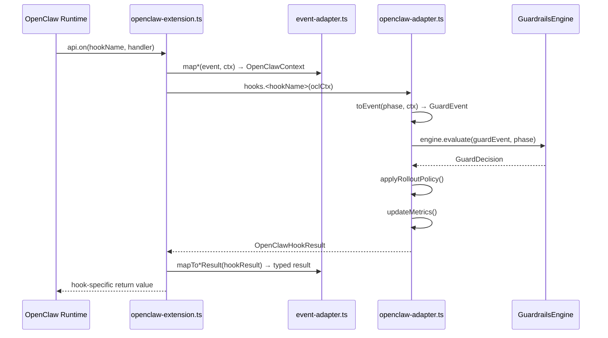
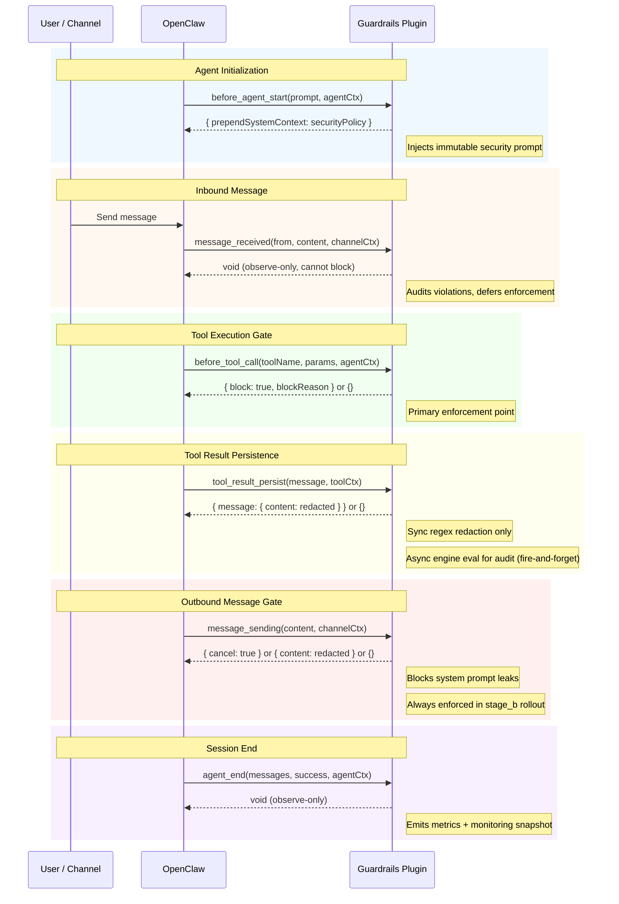
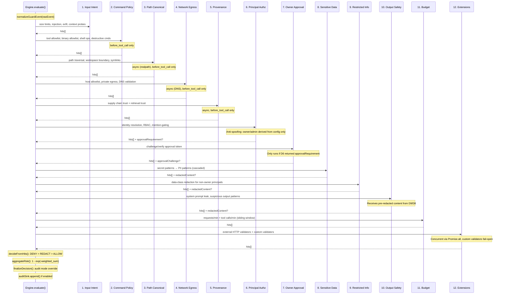
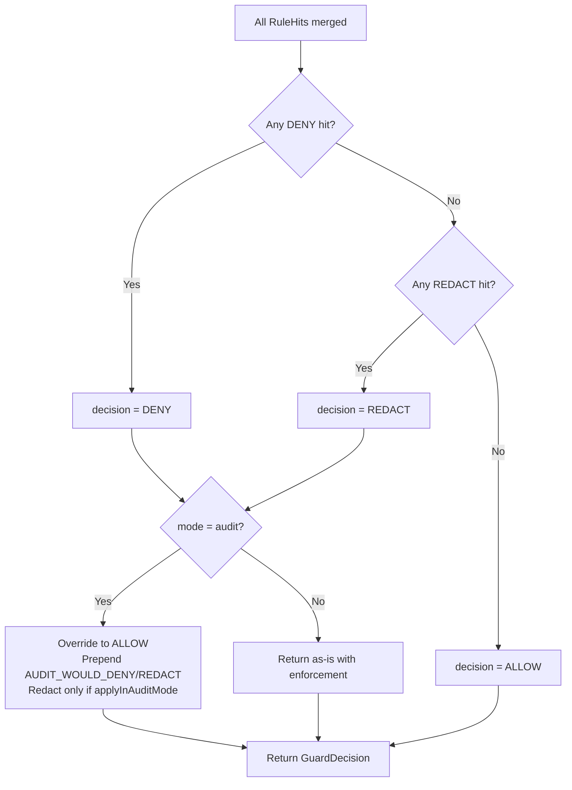
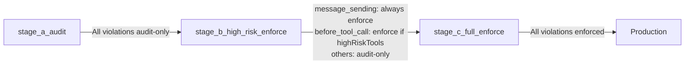
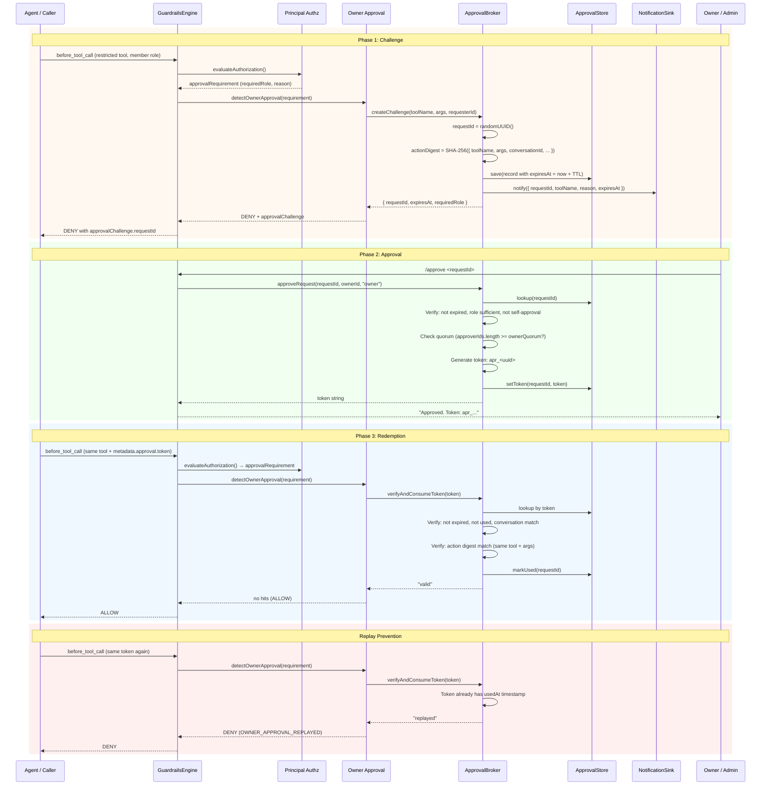
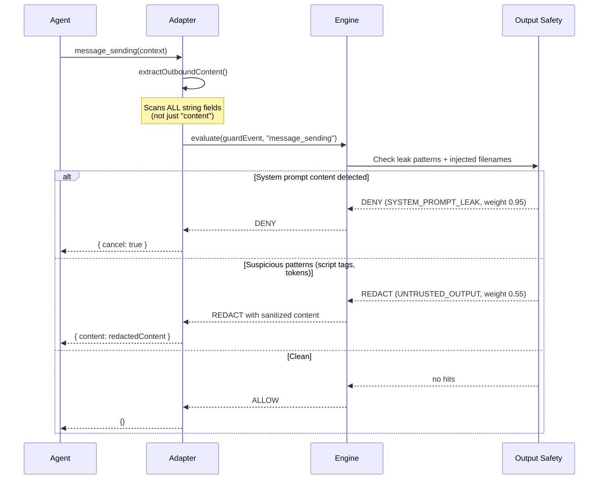
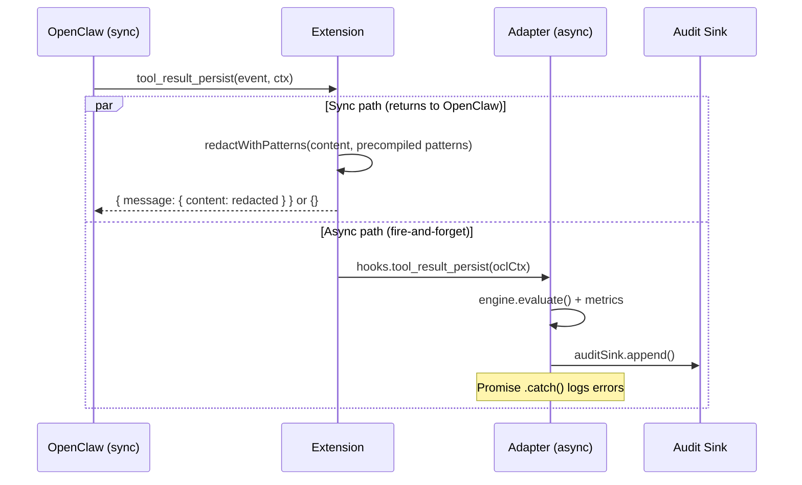
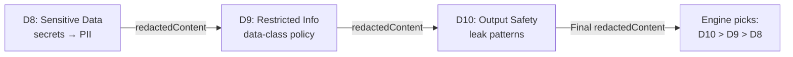

# OpenClaw Guardrails

> **Experimental** -- This project is under active development and not yet production-ready. APIs, config schemas, and behavior may change without notice between releases.

Native TypeScript security kernel for OpenClaw (`>=2026.2.25`) with deterministic local enforcement, principal-aware authorization, and owner approval for group/multi-user safety.

## Repository Context

- Root project overview: [`../../README.md`](../../README.md)
- Research and threat analysis: [`../../docs/openclaw-llm-security-research.md`](../../docs/openclaw-llm-security-research.md)
- OWASP LLM coverage mapping: see the research doc above.

## Core Model

- One engine path for all phases (`GuardrailsEngine`).
- Fixed-order detector pipeline with deterministic reason codes.
- Monotonic precedence: `DENY > REDACT > ALLOW`.
- No runtime dependency on remote inference or policy services.
- Zero runtime dependencies — uses only Node.js built-ins (`fetch()`, `fs`).
- Audit mode still applies redaction by default.

## How It Works

### Plugin ↔ Engine Flow

The plugin has three layers: `openclaw-extension.ts` registers typed hooks with OpenClaw, `event-adapter.ts` maps between OpenClaw's structured `(event, ctx)` pairs and the internal `OpenClawContext`, and `openclaw-adapter.ts` converts contexts into `GuardEvent`s for the engine.



### Hook Lifecycle

Six lifecycle hooks span the full agent interaction. Each hook has different blocking/redaction capabilities:



### Hook Capability Matrix

| Hook | Can Block | Can Redact | Can Cancel | Return Type |
|---|---|---|---|---|
| `before_agent_start` | No | No | No | `{ prependSystemContext }` |
| `message_received` | No (void) | No | No | void |
| `before_tool_call` | **Yes** | No | No | `{ block, blockReason }` |
| `tool_result_persist` | No | **Yes** (sync) | No | `{ message }` |
| `message_sending` | **Yes** | **Yes** | **Yes** | `{ cancel }` or `{ content }` |
| `agent_end` | No (void) | No | No | void |

### Detector Pipeline

All 12 detectors run sequentially for every `engine.evaluate()` call. No short-circuiting — an early DENY does not skip later detectors. All hits are merged, then `DENY > REDACT > ALLOW` precedence determines the outcome.



#### Detector Details

| # | Detector | Active Phases | What It Checks | Decision | Weight |
|---|---|---|---|---|---|
| 1 | Input Intent | All | Input size limits, prompt injection patterns, exfiltration patterns, context probing (injected filenames, workspace probing) | DENY | 0.75–0.95 |
| 2 | Command Policy | `before_tool_call` | Tool allowlist, binary allowlist, shell operators, destructive command patterns, arg pattern validation | DENY | 0.8–1.0 |
| 3 | Path Canonical | `before_tool_call` | Path traversal patterns, workspace boundary (realpath), symlink traversal | DENY | 0.9–0.95 |
| 4 | Network Egress | `before_tool_call` | Host allowlist, private/local IP blocking, DNS resolution, egress tool detection | DENY | 0.7–0.9 |
| 5 | Provenance | `before_tool_call` | Skill source trust, hash integrity, retrieval trust level, signed source | DENY | 0.7–0.85 |
| 6 | Principal Authz | All | Identity resolution, role-based tool policy, mention-gating, group channel enforcement, data-class restrictions | DENY | 0.7–0.95 |
| 7 | Owner Approval | Conditional | Challenge creation, token verification (TTL, digest, conversation, replay) | DENY | 0.8–0.9 |
| 8 | Sensitive Data | All | Secret patterns (AWS keys, GitHub PATs, PEM keys, etc.), PII patterns (emails, SSNs, credit cards) | REDACT | 0.5–0.7 |
| 9 | Restricted Info | `message_received`, `tool_result_persist`, `message_sending` | Data-class policy for non-owner principals, cross-principal redaction | DENY/REDACT | 0.7–0.9 |
| 10 | Output Safety | `message_received`, `tool_result_persist`, `message_sending` | System prompt leak patterns, injected filename references, suspicious patterns (script tags, bearer tokens) | DENY/REDACT | 0.55–0.95 |
| 11 | Budget | All (tool calls: `before_tool_call` only) | Requests/minute, tool calls/minute (sliding 60s window, per-principal partitioned) | DENY | 0.65–0.75 |
| 12 | Extensions | All | External HTTP validators (circuit breaker, timeout), custom validator functions (phase-filtered) | DENY | 0.5–0.7 |

### Risk Scoring

Risk score formula: `1 - exp(-Σ(clamp(weight, 0, 1) × multiplier))` where DENY multiplier = 1.0, REDACT multiplier = 0.6. This produces a diminishing-returns curve: many small hits converge toward 1.0 but never exceed it. Rounded to 4 decimal places.

### Decision Finalization



### Rollout Stages



## Security Features

### Identity and Authorization
- Principal-aware identity model (`owner/admin/member/unknown`).
- **Anti-spoofing**: privileged roles (`owner`/`admin`) are derived exclusively from `principal.ownerIds`/`adminIds` in config — caller-supplied `metadata.role` values of `"owner"` or `"admin"` are downgraded to `"member"`.
- Group-aware authorization (mention-gating + role-based tool policy).

### Owner Approval Workflow



**Approval verification checks** (in order):
1. Token exists and maps to a valid record
2. Record not expired (TTL from creation)
3. Token not already consumed (`usedAt` is null)
4. RequestId matches (if provided by caller)
5. Requester identity matches original requester
6. Conversation matches (if `bindToConversation` enabled)
7. Action digest matches (SHA-256 of tool + args + context)

### Outbound Guard (System Prompt Leak Prevention)



### `tool_result_persist` — Split Sync/Async Strategy

This hook is synchronous in OpenClaw but the engine is async. The adapter splits the work:



### Reason Code Sanitization

Sensitive reason codes are replaced before reaching the client to prevent detection fingerprinting:

| Internal Code | Client-Facing Code |
|---|---|
| `SECRET_DETECTED` | `CONTENT_POLICY_VIOLATION` |
| `PII_DETECTED` | `CONTENT_POLICY_VIOLATION` |
| `EXFIL_PATTERN` | `CONTENT_POLICY_VIOLATION` |
| `SYSTEM_PROMPT_LEAK` | `CONTENT_POLICY_VIOLATION` |

All other reason codes pass through unchanged.

### Redaction Cascade

Sensitive data, restricted info, and output safety detectors produce redacted content in a priority chain:



## Architecture

```
src/
├── index.ts                          # Public exports
├── core/
│   ├── engine.ts                     # Ordered detector pipeline + final decisioning
│   ├── identity.ts                   # Principal normalization + anti-spoofing
│   ├── authorization.ts              # Role/channel/data-class policy evaluation
│   ├── approval.ts                   # Owner approval broker + notification sink
│   ├── approval-store.ts             # Persistent approval state + pruning
│   ├── audit-sink.ts                 # JSONL audit event sink
│   ├── budget-store.ts               # Per-principal budget tracking
│   ├── custom-validator.ts           # Custom validator interface
│   ├── jsonl-writer.ts               # Shared JSONL append writer
│   ├── notification-sink.ts          # Admin notification sink interface + impls
│   ├── token-usage-store.ts          # Per-user token usage tracking
│   ├── normalize.ts                  # Event normalization
│   ├── event-utils.ts                # Guard event helpers
│   ├── scoring.ts                    # Risk score aggregation
│   ├── reason-codes.ts               # Canonical reason code constants
│   ├── types.ts                      # Core type definitions
│   ├── command-parse.ts              # Command string parsing
│   ├── network-guard.ts              # Network host/URL validation
│   ├── path-canonical.ts             # Path canonicalization + symlink checks
│   ├── retrieval-trust.ts            # Retrieval trust level evaluation
│   ├── supply-chain.ts               # Skill source + hash policy
│   └── detectors/                    # Security detector modules
│       ├── index.ts                  # Detector exports
│       ├── types.ts                  # Detector type definitions
│       ├── budget-detector.ts        # Per-principal budget enforcement
│       ├── command-policy-detector.ts    # Command allow/deny + shell operator blocking
│       ├── external-validator-detector.ts  # HTTP external validation + circuit breaker
│       ├── input-intent-detector.ts  # Prompt injection, exfiltration, context probing
│       ├── network-egress-detector.ts    # Host allowlist + private IP blocking
│       ├── output-safety-detector.ts     # System prompt leak + filename injection
│       ├── owner-approval-detector.ts    # Approval challenge gating
│       ├── path-canonical-detector.ts    # Symlink traversal detection
│       ├── principal-authz-detector.ts   # Role-based authorization
│       ├── provenance-detector.ts    # Skill source trust + hash integrity
│       ├── restricted-info-detector.ts   # Non-privileged group redaction
│       └── sensitive-data-detector.ts    # Secret/PII detection
├── plugin/
│   ├── version.ts                    # Shared version constant
│   ├── event-adapter.ts              # OpenClaw typed hook ↔ internal context mapping
│   ├── openclaw-adapter.ts           # Core guardrails engine adapter + telemetry
│   └── openclaw-extension.ts         # Plugin entry point (api.on() typed hooks)
├── redaction/
│   └── redact.ts                     # Secret/PII redaction engine (cached regex)
└── rules/
    ├── default-policy.ts             # Default config factory + merge
    └── patterns.ts                   # Detection pattern definitions
```

## Install in OpenClaw

```bash
openclaw plugins install @safefence/openclaw-guardrails
openclaw plugins list
```

### Configure `openclaw.config.ts`

```ts
import { defineConfig } from "openclaw/config";

export default defineConfig({
  plugins: {
    entries: {
      "openclaw-guardrails": {
        enabled: true,
        config: {
          workspaceRoot: "/workspace/project",
          mode: "enforce",
          failClosed: true
        }
      }
    }
  }
});
```

After changing plugin install/config, restart the OpenClaw service or gateway process so hook registration is reloaded.

## Usage

Three main entry points:

```ts
// 1. OpenClaw plugin — default export, auto-discovered by OpenClaw via
//    package.json "openclaw.extensions". Registers all typed hooks via api.on().
import { openclawGuardrailsPlugin } from "@safefence/openclaw-guardrails";
// openclawGuardrailsPlugin.register(api) is called automatically by OpenClaw.

// 2. Plugin factory — returns a guardrails engine with hook handlers,
//    useful for testing or manual integration.
import { createOpenClawGuardrailsPlugin } from "@safefence/openclaw-guardrails";

const plugin = createOpenClawGuardrailsPlugin({
  workspaceRoot: "/workspace/project",
  mode: "enforce",
  failClosed: true
});

// Out-of-band owner approval
const token = plugin.approveRequest(requestId, "owner-user-id", "owner");

// 3. Engine directly — for custom integrations outside OpenClaw
import { GuardrailsEngine } from "@safefence/openclaw-guardrails";
const engine = new GuardrailsEngine(config);
const decision = await engine.evaluate(event);
```

### Plugin with advanced options

```ts
import {
  createOpenClawGuardrailsPlugin,
  JsonlAuditSink,
  CallbackNotificationSink
} from "@safefence/openclaw-guardrails";

const plugin = createOpenClawGuardrailsPlugin({
  config: {
    workspaceRoot: "/workspace/project",
    audit: { enabled: true, sinkPath: "/var/log/guardrails/audit.jsonl" },
    budgetPersistence: { enabled: true, storagePath: "/data/token-usage.jsonl" },
    notifications: { enabled: true },
    externalValidation: {
      enabled: true,
      endpoint: "https://guard.example.com/validate",
      validators: ["jailbreak", "pii"],
      timeoutMs: 3000,
      failOpen: true
    }
  },
  auditSink: new JsonlAuditSink("/var/log/guardrails/audit.jsonl"),
  notificationSink: new CallbackNotificationSink(async (notification) => {
    await sendSlackMessage(adminChannel, `Approval needed: ${notification.reason}`);
  })
});
```

### Custom validators

```ts
import { GuardrailsEngine } from "@safefence/openclaw-guardrails";
import type { CustomValidator } from "@safefence/openclaw-guardrails";

const spendingLimit: CustomValidator = {
  id: "spending-limit",
  phases: ["before_tool_call"],
  validate({ event }) {
    if (event.toolName === "purchase" && event.args.amount > 1000) {
      return [{ ruleId: "spending-limit", reasonCode: "OVER_LIMIT", decision: "DENY", weight: 1 }];
    }
    return [];
  }
};

const engine = new GuardrailsEngine(config, { customValidators: [spendingLimit] });
```

**Exported types**: `ApproverRole`, `ChannelType`, `DataClass`, `Decision`, `PrincipalContext`, `PrincipalRole`, `RolloutStage`, `GuardDecision`, `GuardEvent`, `GuardrailsConfig`, `Phase`, `TokenUsageSummary`, `AuditEvent`, `AuditSink`, `CustomValidator`, `CustomValidatorContext`, `NotificationSink`, `ApprovalNotification`, `TokenUsageRecord`, `EngineOptions`, `PluginOptions`.

**Exported constants**: `REASON_CODES`, `UNKNOWN_SENDER`, `UNKNOWN_CONVERSATION`.

**Exported classes**: `GuardrailsEngine`, `JsonlAuditSink`, `NoopAuditSink`, `ConsoleNotificationSink`, `CallbackNotificationSink`, `NoopNotificationSink`, `TokenUsageStore`.

**Config helpers**: `createDefaultConfig()`, `mergeConfig(base, overrides)`.

## Config Reference

| Section | Key | Type | Default | Description |
|---------|-----|------|---------|-------------|
| *(root)* | `mode` | `"enforce" \| "audit"` | `"enforce"` | Whether violations block or just log |
| *(root)* | `failClosed` | `boolean` | `true` | On engine error: DENY (true) or ALLOW (false) |
| *(root)* | `workspaceRoot` | `string` | `process.cwd()` | Anchor for path resolution |
| `allow` | `tools` | `string[]` | 8 tools | Allowed tool names |
| `allow` | `commands` | `CommandEntry[]` | 6 binaries | Allowed binaries with optional argPattern |
| `allow` | `writablePaths` | `string[]` | `[workspaceRoot]` | Filesystem write boundary |
| `allow` | `networkHosts` | `string[]` | localhost only | Allowed egress hosts |
| `allow` | `allowPrivateEgress` | `boolean` | `false` | Allow RFC 1918 / loopback destinations |
| `deny` | `commandPatterns` | `string[]` | 8 patterns | Destructive command regexes |
| `deny` | `pathPatterns` | `string[]` | 8 patterns | Path traversal regexes |
| `deny` | `promptInjectionPatterns` | `string[]` | 6 patterns | Injection attempt regexes |
| `deny` | `exfiltrationPatterns` | `string[]` | 4 patterns | Data exfiltration regexes |
| `deny` | `shellOperatorPatterns` | `string[]` | 9 patterns | Shell chaining/redirect regexes |
| `redaction` | `secretPatterns` | `string[]` | 7 patterns | Secret detection regexes (AWS, GitHub, PEM, etc.) |
| `redaction` | `piiPatterns` | `string[]` | 4 patterns | PII detection regexes (email, SSN, CC, phone) |
| `redaction` | `replacement` | `string` | `"[REDACTED]"` | Replacement string for matches |
| `redaction` | `applyInAuditMode` | `boolean` | `true` | Redact even when mode=audit |
| `limits` | `maxInputChars` | `number` | `20000` | Max input content length |
| `limits` | `maxToolArgChars` | `number` | `10000` | Max serialized tool args length |
| `limits` | `maxOutputChars` | `number` | `50000` | Max tool output length |
| `limits` | `maxRequestsPerMinute` | `number` | `120` | Rate limit: requests per 60s window |
| `limits` | `maxToolCallsPerMinute` | `number` | `60` | Rate limit: tool calls per 60s window |
| `pathPolicy` | `enforceCanonicalRealpath` | `boolean` | `true` | Resolve symlinks and verify workspace boundary |
| `pathPolicy` | `denySymlinkTraversal` | `boolean` | `true` | Block symlinks that escape workspace |
| `supplyChain` | `trustedSkillSources` | `string[]` | — | Allowed skill installation domains |
| `supplyChain` | `requireSkillHash` | `boolean` | `true` | Require hash for remote skills |
| `supplyChain` | `allowedSkillHashes` | `string[]` | — | Pre-approved skill hashes |
| `principal` | `requireContext` | `boolean` | `true` | Require identity context |
| `principal` | `ownerIds` | `string[]` | `[]` | User IDs with owner privilege |
| `principal` | `adminIds` | `string[]` | `[]` | User IDs with admin privilege |
| `principal` | `failUnknownInGroup` | `boolean` | `true` | Deny unknown users in group channels |
| `authorization` | `defaultEffect` | `"deny" \| "allow"` | `"deny"` | Default when no explicit rule matches |
| `authorization` | `requireMentionInGroups` | `boolean` | `true` | Require @mention for group messages |
| `authorization` | `restrictedTools` | `string[]` | 6 tools | Tools requiring elevated role or approval |
| `authorization` | `restrictedDataClasses` | `string[]` | — | Data classes requiring elevated access |
| `authorization` | `toolAllowByRole` | `Record<Role, string[]>` | Role-tiered | Per-role tool access lists |
| `approval` | `enabled` | `boolean` | `true` | Enable owner approval workflow |
| `approval` | `ttlSeconds` | `number` | `300` | Approval challenge TTL |
| `approval` | `requireForTools` | `string[]` | 6 tools | Tools requiring approval |
| `approval` | `requireForDataClasses` | `string[]` | `["restricted", "secret"]` | Data classes requiring approval |
| `approval` | `ownerQuorum` | `number` | `1` | Number of approvers required |
| `approval` | `bindToConversation` | `boolean` | `true` | Bind token to originating conversation |
| `approval` | `storagePath` | `string?` | — | JSON file for persistent approvals |
| `tenancy` | `budgetKeyMode` | `string` | `"agent+principal+conversation"` | Budget partitioning strategy |
| `tenancy` | `redactCrossPrincipalOutput` | `boolean` | `true` | Redact vs deny for restricted data |
| `outboundGuard` | `enabled` | `boolean` | `true` | Enable outbound leak prevention |
| `outboundGuard` | `systemPromptLeakPatterns` | `string[]` | 8 patterns | Patterns indicating prompt leakage |
| `outboundGuard` | `injectedFileNames` | `string[]` | 9 names | Config filenames to block in output |
| `rollout` | `stage` | `RolloutStage` | `"stage_c_full_enforce"` | Current enforcement stage |
| `rollout` | `highRiskTools` | `string[]` | — | Tools enforced in stage B |
| `monitoring` | `falsePositiveThresholdPct` | `number` | `3` | False positive rate threshold |
| `monitoring` | `consecutiveDaysForTuning` | `number` | `2` | Days above threshold before signaling |
| `audit` | `enabled` | `boolean` | `false` | Enable JSONL audit trail |
| `audit` | `sinkPath` | `string?` | — | File path for JSONL audit events |
| `externalValidation` | `enabled` | `boolean` | `false` | Enable HTTP external validators |
| `externalValidation` | `endpoint` | `string` | — | POST endpoint for validation requests |
| `externalValidation` | `timeoutMs` | `number?` | `5000` | Per-request timeout |
| `externalValidation` | `validators` | `string[]` | `[]` | Validator names to invoke |
| `externalValidation` | `failOpen` | `boolean` | `false` | Allow on timeout/error |
| `budgetPersistence` | `enabled` | `boolean` | `false` | Enable token usage tracking |
| `budgetPersistence` | `storagePath` | `string?` | — | JSONL path for usage persistence |
| `notifications` | `enabled` | `boolean` | `false` | Enable approval notifications |
| `notifications` | `adminChannelId` | `string?` | — | Target channel for notifications |

## Migration

### v0.6.0 → v0.6.1

1. **Plugin API alignment**: The plugin now uses OpenClaw's typed hook system (`api.on()`) instead of `api.registerHook()`. Security decisions (block, cancel, redact) are now properly honoured by OpenClaw's pipeline — previously they were silently discarded.
2. **New event adapter layer**: `src/plugin/event-adapter.ts` bridges OpenClaw's structured `(event, ctx)` hook pairs to the internal `OpenClawContext`. No changes needed for users of `createOpenClawGuardrailsPlugin()` or `GuardrailsEngine` directly.
3. **Plugin export**: The default export is now an `{ id, name, version, register }` object (compatible with `resolvePluginModuleExport()`). The `registerOpenClawGuardrails` named export is preserved for backward compatibility.
4. **`tool_result_persist` sync redaction**: Uses the existing `redactWithPatterns()` utility for synchronous redaction. Full async engine evaluation runs fire-and-forget for audit/metrics.
5. **Manifest cleaned**: Removed unrecognized `entry` and `hooks` fields from `openclaw.plugin.json`. Set `additionalProperties: false` on root config schema.
6. **Peer dependency**: `openclaw` is now declared as a `peerDependency` (`>=2026.2.25`).

### v0.5.x → v0.6.0

1. `GuardrailsEngine` constructor now takes `(config, options?)` instead of `(config, budgetStore?, approvalBroker?)`. Pass dependencies via `EngineOptions`.
2. `createOpenClawGuardrailsPlugin()` accepts both `Partial<GuardrailsConfig>` (unchanged) and `PluginOptions` (new) for injecting audit sinks, notification sinks, etc.
3. New config sections (`audit`, `externalValidation`, `budgetPersistence`, `notifications`) default to disabled — no breaking changes for existing configs.
4. New reason codes: `EXTERNAL_VALIDATION_FAILED`, `EXTERNAL_VALIDATION_TIMEOUT`.

### v0.3.x → v0.4.0

1. Add `principal`, `authorization`, `approval`, and `tenancy` config blocks.
2. Pass sender/channel metadata in hook contexts (`senderId`, `conversationId`, `channelType`, `mentionedAgent`).
3. Integrate owner approval handling via `approvalChallenge.requestId` + `plugin.approveRequest(...)`.
4. Keep secure defaults unless you have a validated exception.
5. Use `rollout.stage` for staged deployment and monitor `metadata.guardrailsMonitoring`.
6. **Breaking**: callers can no longer self-assign privileged roles (`owner`/`admin`) via `metadata.role`. Privileged roles are now derived exclusively from `principal.ownerIds`/`adminIds` in config. Any caller-supplied `"owner"` or `"admin"` role is downgraded to `"member"`.

## Limitations

- Deterministic patterns are not a full semantic jailbreak solution.
- Persistent approval store prunes expired records on write; replayed tokens are still caught within the TTL window. Approval tokens survive restarts when `storagePath` is configured.
- Retrieval trust still depends on upstream metadata quality.
- External validator circuit breaker state is module-scoped (shared across engine instances in the same process).
- Token usage `records` array grows unboundedly in memory for long-running processes. Use JSONL persistence and restart periodically for high-volume deployments.

## Development

```bash
cd packages/openclaw-guardrails
npm install
npm test
npm run test:coverage
npm run build
```
