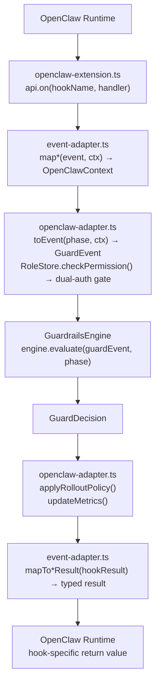
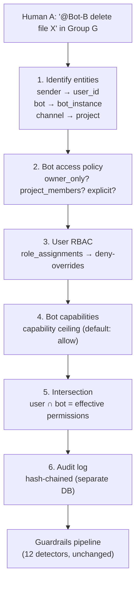
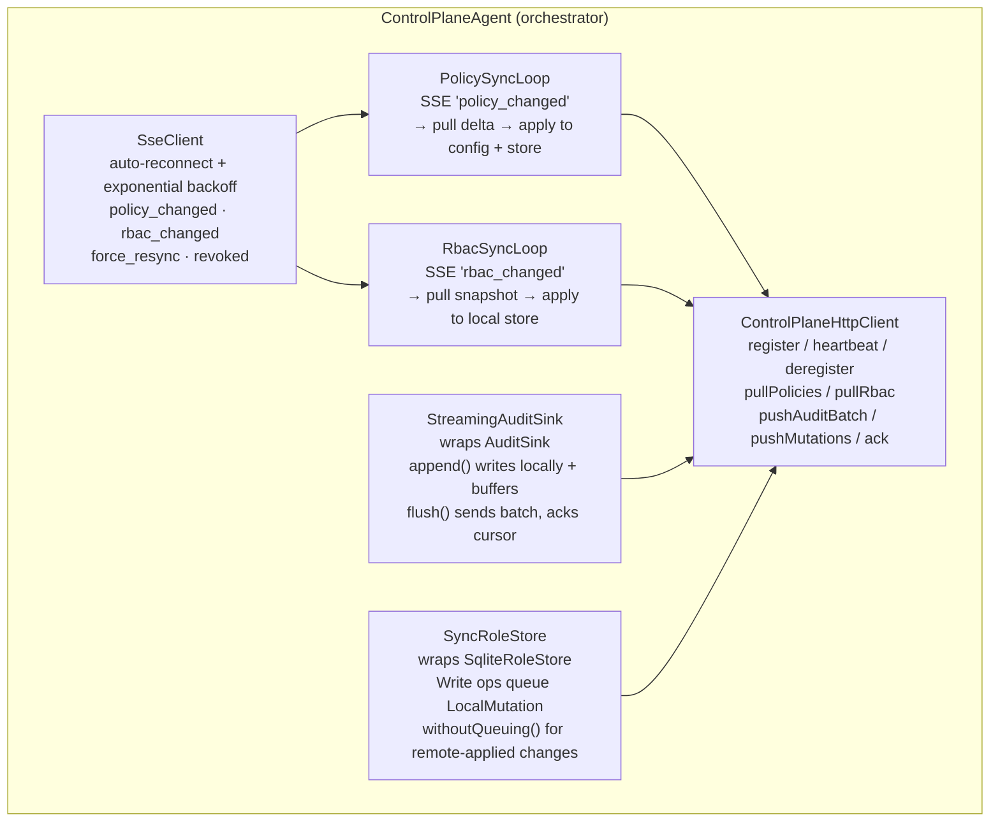

# Architecture & Internals

Detailed technical documentation for `@safefence/openclaw-guardrails`.

## Core Model

- One engine path for all phases (`GuardrailsEngine`).
- Fixed-order detector pipeline with deterministic reason codes.
- Monotonic precedence: `DENY > REDACT > ALLOW`.
- No runtime dependency on remote inference or policy services for local enforcement.
- Zero runtime dependencies for standalone mode — uses only Node.js built-ins (`fetch()`, `fs`).
- Optional control plane sync for centralized policy, RBAC, and audit management across instances.
- Dual-authorization RBAC: effective permission = user roles ∩ bot capabilities.
- Persistent SQLite store for roles, bot instances, and hash-chained audit log.
- Backward-compatible: falls back to config-based `ownerIds`/`adminIds` when RBAC store is not enabled.
- Audit mode still applies redaction by default.

## Plugin ↔ Engine Flow

The plugin has three layers: `openclaw-extension.ts` registers typed hooks with OpenClaw, `event-adapter.ts` maps between OpenClaw's structured `(event, ctx)` pairs and the internal `OpenClawContext`, and `openclaw-adapter.ts` converts contexts into `GuardEvent`s for the engine.



## Hook Lifecycle

Six lifecycle hooks span the full agent interaction. Each hook has different blocking/redaction capabilities:

```mermaid
sequenceDiagram
    participant U as User / Channel
    participant OC as OpenClaw
    participant GP as Guardrails Plugin

    OC->>GP: before_agent_start(prompt, agentCtx)
    GP-->>OC: { prependSystemContext: securityPolicy }
    Note over OC,GP: Injects immutable security prompt

    U->>OC: message
    OC->>GP: message_received(from, content, channelCtx)
    GP-->>OC: void — observe only, cannot block
    Note over OC,GP: Audits violations, defers enforcement

    OC->>GP: before_tool_call(toolName, params, agentCtx)
    GP-->>OC: { block: true, blockReason } or {}
    Note over OC,GP: Primary enforcement point

    OC->>GP: tool_result_persist(message, toolCtx)
    GP-->>OC: { message: { content: redacted } } or {}
    Note over OC,GP: Sync regex redaction; async engine eval for audit

    OC->>GP: message_sending(content, channelCtx)
    GP-->>OC: { cancel: true } or { content: redacted } or {}
    Note over OC,GP: Blocks system prompt leaks; always enforced in stage_b

    OC->>GP: agent_end(messages, success, agentCtx)
    GP-->>OC: void — observe only
    Note over OC,GP: Emits metrics + monitoring snapshot
```

### Hook Capability Matrix

| Hook | Can Block | Can Redact | Can Cancel | Return Type |
|---|---|---|---|---|
| `before_agent_start` | No | No | No | `{ prependSystemContext }` |
| `message_received` | No (void) | No | No | void |
| `before_tool_call` | **Yes** | No | No | `{ block, blockReason }` |
| `tool_result_persist` | No | **Yes** (sync) | No | `{ message }` |
| `message_sending` | **Yes** | **Yes** | **Yes** | `{ cancel }` or `{ content }` |
| `agent_end` | No (void) | No | No | void |

## Detector Pipeline

All 12 detectors run sequentially for every `engine.evaluate()` call. No short-circuiting — an early DENY does not skip later detectors. All hits are merged, then `DENY > REDACT > ALLOW` precedence determines the outcome.

```mermaid
flowchart TD
    IN["engine.evaluate()\nnormalizeGuardEvent(rawEvent)"]

    D1["D1 Input Intent\nsize limits · injection · exfil · context probes"]
    D2["D2 Command Policy\ntool allowlist · binary allowlist · shell ops\n(before_tool_call only)"]
    D3["D3 Path Canonical\npath traversal · workspace boundary · symlinks\n(async, before_tool_call only)"]
    D4["D4 Network Egress\nhost allowlist · private egress · DNS\n(async, before_tool_call only)"]
    D5["D5 Provenance\nsupply chain trust · retrieval trust\n(async, before_tool_call only)"]
    D6["D6 Principal Authz\ndual-auth: user RBAC ∩ bot caps · mention-gating\n→ approvalRequirement?"]
    D7["D7 Owner Approval\nchallenge / verify approval token\n(only if D6 returned approvalRequirement)"]
    D8["D8 Sensitive Data\nsecret patterns → PII patterns (cascaded)\n→ redactedContent?"]
    D9["D9 Restricted Info\ndata-class redaction for non-owner principals\n→ redactedContent?"]
    D10["D10 Output Safety\nprompt leak · injected filenames · suspicious patterns\nreceives pre-redacted content from D8/D9\n→ redactedContent?"]
    D11["D11 Budget\nrequests/min + tool calls/min (sliding window)"]
    D12["D12 Extensions\nexternal HTTP + custom validators\n(concurrent via Promise.all, fail-open)"]
    DECIDE["decideFromHits(): DENY > REDACT > ALLOW\naggregateRisk(): 1 - exp(-weighted_sum)\nfinalizeDecision(): audit mode override\nauditSink.append() if enabled"]

    IN --> D1 --> D2 --> D3 --> D4 --> D5 --> D6 --> D7 --> D8 --> D9 --> D10 --> D11 --> D12 --> DECIDE
```



### Detector Details

| # | Detector | Active Phases | What It Checks | Decision | Weight |
|---|---|---|---|---|---|
| 1 | Input Intent | All | Input size limits, prompt injection patterns, exfiltration patterns, context probing (injected filenames, workspace probing) | DENY | 0.75–0.95 |
| 2 | Command Policy | `before_tool_call` | Tool allowlist, binary allowlist, shell operators, destructive command patterns, arg pattern validation | DENY | 0.8–1.0 |
| 3 | Path Canonical | `before_tool_call` | Path traversal patterns, workspace boundary (realpath), symlink traversal | DENY | 0.9–0.95 |
| 4 | Network Egress | `before_tool_call` | Host allowlist, private/local IP blocking, DNS resolution, egress tool detection | DENY | 0.7–0.9 |
| 5 | Provenance | `before_tool_call` | Skill source trust, hash integrity, retrieval trust level, signed source | DENY | 0.7–0.85 |
| 6 | Principal Authz | All | Dual-authorization check (user RBAC ∩ bot capabilities via RoleStore), identity resolution, mention-gating, group channel enforcement, data-class restrictions | DENY | 0.7–0.95 |
| 7 | Owner Approval | Conditional | Challenge creation, token verification (TTL, digest, conversation, replay) | DENY | 0.8–0.9 |
| 8 | Sensitive Data | All | Secret patterns (AWS keys, GitHub PATs, PEM keys, etc.), PII patterns (emails, SSNs, credit cards) | REDACT | 0.5–0.7 |
| 9 | Restricted Info | `message_received`, `tool_result_persist`, `message_sending` | Data-class policy for non-owner principals, cross-principal redaction | DENY/REDACT | 0.7–0.9 |
| 10 | Output Safety | `message_received`, `tool_result_persist`, `message_sending` | System prompt leak patterns, injected filename references, suspicious patterns (script tags, bearer tokens) | DENY/REDACT | 0.55–0.95 |
| 11 | Budget | All (tool calls: `before_tool_call` only) | Requests/minute, tool calls/minute (sliding 60s window, per-principal partitioned) | DENY | 0.65–0.75 |
| 12 | Extensions | All | External HTTP validators (circuit breaker, timeout), custom validator functions (phase-filtered) | DENY | 0.5–0.7 |

## Risk Scoring

Risk score formula: `1 - exp(-Σ(clamp(weight, 0, 1) × multiplier))` where DENY multiplier = 1.0, REDACT multiplier = 0.6. This produces a diminishing-returns curve: many small hits converge toward 1.0 but never exceed it. Rounded to 4 decimal places.

## Decision Finalization

```
All RuleHits merged
  │
  ▼
Any DENY hit? ──Yes──► decision = DENY ──┐
  │ No                                    │
  ▼                                       ▼
Any REDACT hit? ──Yes──► decision = REDACT ──► mode = audit?
  │ No                                           │
  ▼                                         Yes ─┤── No
decision = ALLOW                                 │      │
  │                                              ▼      ▼
  │                              Override to ALLOW    Return as-is
  │                              + AUDIT_WOULD_DENY   with enforcement
  │                              + redact only if         │
  │                                applyInAuditMode       │
  │                                     │                 │
  └─────────────────────────────────────┴─────────────────┘
                        │
                        ▼
                 Return GuardDecision
```

## Dual-Authorization Model

When `rbacStore.enabled` is true, the principal authorization detector (D6) uses the persistent RoleStore instead of config-based role inference. Every request goes through dual authorization:



### Permission Categories

| Category | Actions | Description |
|----------|---------|-------------|
| `tool_use` | `read`, `write`, `exec`, `apply_patch`, `skills_install`, `*` | Tool execution permissions |
| `guardrail` | `enforce`, `audit_only`, `bypass`, `configure` | Guardrail enforcement level |
| `data_access` | `public`, `internal`, `restricted`, `secret` | Data classification access |
| `budget` | `view`, `unlimited` | Usage and rate limit controls |
| `admin` | `role_manage`, `role_assign`, `project_manage`, `channel_manage`, `team_manage`, `bot_manage` | Administration permissions |
| `approval` | `approve`, `request` | Approval workflow permissions |

### Security Invariants

- **Deny-overrides**: within user RBAC, if any role denies a permission, it's denied regardless of other roles.
- **Bot capability ceiling**: bot owner can restrict capabilities; this ceiling applies to ALL users of that bot.
- **Access policy enforcement**: `owner_only` / `project_members` / `explicit` control who can use a bot.
- **Last-superadmin protection**: cannot revoke the last superadmin role assignment in a project.
- **Audit tamper-evidence**: SHA-256 hash chain on every record; SQLite triggers prevent UPDATE/DELETE.
- **Fail-closed**: store error → ConfigRoleStore fallback → engine `failClosed: true`.

## Rollout Stages

```
stage_a_audit ──────────────────► stage_b_high_risk_enforce ──────────► stage_c_full_enforce ──► Production
  All violations                    message_sending: always enforce       All violations
  audit-only                        before_tool_call: enforce if           enforced
                                      highRiskTools
                                    others: audit-only
```

## Security Features

### Identity and Authorization
- Principal-aware identity model (`owner/admin/member/unknown`).
- **Anti-spoofing**: privileged roles (`owner`/`admin`) are derived exclusively from `principal.ownerIds`/`adminIds` in config — caller-supplied `metadata.role` values of `"owner"` or `"admin"` are downgraded to `"member"`.
- Group-aware authorization (mention-gating + role-based tool policy).

### Owner Approval Workflow

```
┌─────────────────────────────────────────────────────────────────────────┐
│ Phase 1: Challenge                                                      │
│                                                                         │
│  Agent ──► Engine: before_tool_call (restricted tool, member role)       │
│    Engine ──► D6 Principal Authz: evaluateAuthorization()               │
│    D6 ◄──── approvalRequirement (requiredRole, reason)                  │
│    Engine ──► D7 Owner Approval: detectOwnerApproval(requirement)       │
│      D7 ──► ApprovalBroker: createChallenge(toolName, args, requesterId)│
│        ApprovalBroker: requestId = randomUUID()                         │
│        ApprovalBroker: actionDigest = SHA-256({toolName, args, ...})    │
│        ApprovalBroker ──► ApprovalStore: save(record, expiresAt)        │
│        ApprovalBroker ──► NotificationSink: notify({requestId, ...})    │
│      D7 ◄── { requestId, expiresAt, requiredRole }                     │
│    Engine ◄── DENY + approvalChallenge                                  │
│  Agent ◄── DENY with approvalChallenge.requestId                        │
└─────────────────────────────────────────────────────────────────────────┘

┌─────────────────────────────────────────────────────────────────────────┐
│ Phase 2: Approval                                                       │
│                                                                         │
│  Owner ──► Engine: /approve <requestId>                                 │
│    Engine ──► ApprovalBroker: approveRequest(requestId, ownerId, "owner")│
│      ApprovalBroker ──► ApprovalStore: lookup(requestId)                │
│      ApprovalBroker: Verify not expired, role sufficient, not self      │
│      ApprovalBroker: Check quorum (approverIds.length >= ownerQuorum?) │
│      ApprovalBroker: Generate token: apr_<uuid>                        │
│      ApprovalBroker ──► ApprovalStore: setToken(requestId, token)      │
│    Engine ◄── token string                                              │
│  Owner ◄── "Approved. Token: apr_..."                                   │
└─────────────────────────────────────────────────────────────────────────┘

┌─────────────────────────────────────────────────────────────────────────┐
│ Phase 3: Redemption                                                     │
│                                                                         │
│  Agent ──► Engine: before_tool_call (same tool + approval.token)        │
│    Engine ──► D7: detectOwnerApproval(requirement)                      │
│      D7 ──► ApprovalBroker: verifyAndConsumeToken(token)               │
│        Verify: not expired, not used, conversation match                │
│        Verify: action digest match (same tool + args)                   │
│        ApprovalStore: markUsed(requestId)                               │
│      D7 ◄── "valid"                                                    │
│    Engine ◄── no hits (ALLOW)                                           │
│  Agent ◄── ALLOW                                                        │
└─────────────────────────────────────────────────────────────────────────┘

┌─────────────────────────────────────────────────────────────────────────┐
│ Replay Prevention                                                       │
│                                                                         │
│  Agent ──► Engine: before_tool_call (same token again)                  │
│    D7 ──► ApprovalBroker: verifyAndConsumeToken(token)                 │
│      Token already has usedAt timestamp                                 │
│    D7 ◄── "replayed"                                                   │
│    Engine ◄── DENY (OWNER_APPROVAL_REPLAYED)                           │
│  Agent ◄── DENY                                                        │
└─────────────────────────────────────────────────────────────────────────┘
```

**Approval verification checks** (in order):
1. Token exists and maps to a valid record
2. Record not expired (TTL from creation)
3. Token not already consumed (`usedAt` is null)
4. RequestId matches (if provided by caller)
5. Requester identity matches original requester
6. Conversation matches (if `bindToConversation` enabled)
7. Action digest matches (SHA-256 of tool + args + context)

### Outbound Guard (System Prompt Leak Prevention)

```
Agent ──► Adapter: message_sending(context)
  │
  │  extractOutboundContent()
  │  (scans ALL string fields, not just "content")
  │
  ▼
Adapter ──► Engine: evaluate(guardEvent, "message_sending")
  │
  ▼
Engine ──► D10 Output Safety: check leak patterns + injected filenames
  │
  ├── System prompt content detected:
  │     D10 → DENY (SYSTEM_PROMPT_LEAK, weight 0.95)
  │     Agent ◄── { cancel: true }
  │
  ├── Suspicious patterns (script tags, tokens):
  │     D10 → REDACT (UNTRUSTED_OUTPUT, weight 0.55)
  │     Agent ◄── { content: redactedContent }
  │
  └── Clean:
        D10 → no hits → ALLOW
        Agent ◄── {}
```

### `tool_result_persist` — Split Sync/Async Strategy

This hook is synchronous in OpenClaw but the engine is async. The adapter splits the work:

```
OpenClaw (sync) ──► Extension: tool_result_persist(event, ctx)
  │
  ├── [Sync path — returns to OpenClaw immediately]
  │     Extension: redactWithPatterns(content, precompiled patterns)
  │     OpenClaw ◄── { message: { content: redacted } } or {}
  │
  └── [Async path — fire-and-forget]
        Extension ──► Adapter: hooks.tool_result_persist(oclCtx)
          Adapter: engine.evaluate() + metrics
          Adapter ──► AuditSink: auditSink.append()
          (Promise .catch() logs errors)
```

### Reason Code Sanitization

Sensitive reason codes are replaced before reaching the client to prevent detection fingerprinting:

| Internal Code | Client-Facing Code |
|---|---|
| `SECRET_DETECTED` | `CONTENT_POLICY_VIOLATION` |
| `PII_DETECTED` | `CONTENT_POLICY_VIOLATION` |
| `EXFIL_PATTERN` | `CONTENT_POLICY_VIOLATION` |
| `SYSTEM_PROMPT_LEAK` | `CONTENT_POLICY_VIOLATION` |

All other reason codes pass through unchanged.

### Redaction Cascade

Sensitive data, restricted info, and output safety detectors produce redacted content in a priority chain:

```
D8: Sensitive Data ──► D9: Restricted Info ──► D10: Output Safety ──► Engine picks:
  (secrets → PII)       (data-class policy)     (leak patterns)        D10 > D9 > D8
       │                       │                       │
       └── redactedContent ──► └── redactedContent ──► └── Final redactedContent
```

## Runtime Policy Store

v0.7.1 introduces a runtime policy store that lets admins change guardrail configuration fields without restarting the gateway. Changes are persisted in SQLite and survive restarts.

### Mutable Fields

22 configuration fields are mutable at runtime, covering: operating mode, rollout stage, rate limits, tool allow/deny lists, approval settings, monitoring thresholds, notification config, and supply chain hashes. All other fields (e.g., `workspaceRoot`, redaction patterns, RBAC store paths) require a config file change and gateway restart.

```
Plugin Registration
  │
  ├── snapshotMutableDefaults(config)  ← capture pre-override values
  │     (deep-copied into module-level Map)
  │
  ├── applyPolicyOverrides(config, store)  ← restore persisted overrides
  │     (reads all rows from policy_overrides table)
  │
  └── Ready
        │
        ▼
/sf policy set <key> <value>
  │
  ├── Validate key ∈ MUTABLE_POLICY_KEYS
  ├── parseFieldValue(raw, fieldDef)
  ├── validateFieldValue(parsed, fieldDef)
  ├── store.setPolicyOverride(key, value, updatedBy)  ← audit-logged
  └── setConfigValue(config, key, value)  ← live mutation, immediate effect

/sf policy reset <key>
  │
  ├── store.deletePolicyOverride(key)  ← audit-logged
  └── setConfigValue(config, key, getMutableDefault(key))  ← restore snapshot
```

### Policy Store SQLite Schema

```sql
CREATE TABLE policy_overrides (
  key TEXT PRIMARY KEY,
  value TEXT,         -- JSON-serialized
  updated_by TEXT,
  updated_at INTEGER
);
```

### Policy Commands

| Command | Description |
|---|---|
| `/sf policy list` | Show active overrides only |
| `/sf policy show` | Show all 22 mutable fields with current values |
| `/sf policy get <key>` | Show current, override, and default values |
| `/sf policy set <key> <value>` | Parse, validate, persist, and apply immediately |
| `/sf policy reset <key>` | Delete override and restore original default |

Policy commands require `guardrail:configure` permission (owners only by default).

## Zero-Config Bootstrap

v0.7.1 enables a zero-config setup flow: the plugin self-initializes without requiring any owner/admin configuration in the config file. On first install, a user can claim ownership via a single `/sf setup` command.

```
Fresh Install
  │
  ├── Plugin registers with default config
  ├── RBAC store created (SQLite, auto-creates .safefence/ directory)
  ├── Policy overrides restored (none on first run)
  ├── hasAnySuperadmin() → false
  └── Logs: "Run /sf setup to claim ownership"
        │
        ▼
User sends: /sf setup
  │
  ├── Bypasses normal auth (only command allowed pre-bootstrap)
  ├── bootstrapFirstOwner(store, senderId, "chat")
  │     │
  │     ├── [SQLite transaction — atomic]
  │     ├── Guard: hasAnySuperadmin() must be false
  │     ├── Create default org + project
  │     ├── Register user + link platform identity
  │     ├── Assign superadmin role
  │     └── Audit log: SETUP_BOOTSTRAP event
  │
  └── Returns welcome message with next-step commands
```

**Security**: The bootstrap is protected by a TOCTOU-safe SQLite transaction. Once a superadmin exists, `/sf setup` is rejected. The CLI also supports `safefence setup` for headless/non-chat bootstrap.

## Dynamic RBAC Role Resolution

v0.7.1 adds `resolveRole(platform, platformId)` to the `RoleStore` interface. This enables the plugin to dynamically determine a user's role from the RBAC store before falling back to static `ownerIds`/`adminIds` in config.

```
Incoming /sf command
  │
  ├── resolveCommandRole(store, config, senderId)
  │     │
  │     ├── store.resolveRole(platform, platformId)
  │     │     ├── [SqliteRoleStore] Query platform_identities → role_assignments → roles
  │     │     │   Returns: "owner" (superadmin) | "admin" | "member" | "unknown"
  │     │     └── [ConfigRoleStore] Check ownerIds/adminIds arrays
  │     │
  │     └── If store returns "owner"/"admin", use it
  │         Otherwise fall back to config.principal.ownerIds/adminIds
  │
  └── Check resolved role against required permission
```

This means bootstrapped owners work without being listed in the config file.

## Control Plane Sync (v0.8.0+)

When `controlPlane.enabled` is true, a `ControlPlaneAgent` wraps the existing `RoleStore` and `AuditSink` with sync-capable decorators. No changes to the engine or detectors.

### Sync Architecture



### TLS Enforcement

The `ControlPlaneHttpClient` enforces HTTPS for all non-localhost control plane connections when `requireTls` is `true` (the default in `NODE_ENV=production`). If the configured `endpoint` uses `http://` for a non-localhost host, the client throws at startup:

```
[safefence] Control plane URL "http://example.com" requires HTTPS for
non-localhost connections. Set requireTls: false to override.
```

To allow plain HTTP in development or behind a TLS-terminating proxy on localhost:

```typescript
controlPlane: {
  enabled: true,
  endpoint: "http://localhost:3100",
  orgApiKey: "sf_...",
  requireTls: false   // explicit override; defaults to true in production
}
```

This check happens before any network connection is made — it is a startup-time configuration guard, not a runtime intercept.

### Data Flow: Policy Sync

```
Admin sets policy in Dashboard
  → Control Plane writes to PostgreSQL
  → Redis pub/sub → SSE event to connected agents
  → Agent pulls delta: GET /api/v1/sync/policies?since=N
  → PolicySyncLoop applies via setPolicyOverride() + setConfigValue()
    (wrapped in withoutQueuing() to prevent echo loop)
  → Agent acks version
```

### Data Flow: Audit Upload

```
Engine evaluates → AuditSink.append(event)
  → StreamingAuditSink writes locally (hash chain preserved)
  → Buffers in memory ring (max 10,000 events)
  → Flushes every 5s via REST: POST /api/v1/sync/audit/batch
  → Cloud acks cursor → agent advances local cursor
```

### Offline Resilience

- **Policy enforcement**: continues with cached config in local SQLite.
- **Audit**: continues writing to local audit.db; replays from cursor on reconnect.
- **Local `/sf` commands**: continue working; mutations queued for upstream sync.
- **Heartbeat**: detects staleness; `force_resync` triggers full snapshot on reconnect.

### Integration Point

In `openclaw-extension.ts`, when `controlPlane.enabled`:

```ts
controlPlaneAgent = new ControlPlaneAgent({
  controlPlaneConfig: fullConfig.controlPlane,
  guardrailsConfig: fullConfig,
  roleStore,          // original SqliteRoleStore
  auditSink,          // original JsonlAuditSink
});
roleStore = controlPlaneAgent.roleStore;     // SyncRoleStore wrapper
// auditSink wired into createOpenClawGuardrailsPlugin
controlPlaneAgent.start();  // async, non-blocking
```

## Source Layout

```
src/
├── index.ts                          # Public exports
├── core/
│   ├── engine.ts                     # Ordered detector pipeline + final decisioning
│   ├── identity.ts                   # Principal normalization + anti-spoofing
│   ├── authorization.ts              # Role/channel/data-class policy evaluation
│   ├── approval.ts                   # Owner approval broker + notification sink
│   ├── approval-store.ts             # Persistent approval state + pruning
│   ├── audit-sink.ts                 # JSONL audit event sink
│   ├── budget-store.ts               # Per-principal budget tracking
│   ├── custom-validator.ts           # Custom validator interface
│   ├── jsonl-writer.ts               # Shared JSONL append writer
│   ├── notification-sink.ts          # Admin notification sink interface + impls
│   ├── token-usage-store.ts          # Per-user token usage tracking
│   ├── normalize.ts                  # Event normalization
│   ├── event-utils.ts                # Guard event helpers
│   ├── scoring.ts                    # Risk score aggregation
│   ├── reason-codes.ts               # Canonical reason code constants
│   ├── types.ts                      # Core type definitions
│   ├── command-parse.ts              # Command string parsing
│   ├── network-guard.ts              # Network host/URL validation
│   ├── path-canonical.ts             # Path canonicalization + symlink checks
│   ├── retrieval-trust.ts            # Retrieval trust level evaluation
│   ├── supply-chain.ts               # Skill source + hash policy
│   ├── role-store.ts                    # RoleStore interface (dual-auth + policy store)
│   ├── config-role-store.ts             # Config-based adapter (backward compat)
│   ├── sqlite-role-store.ts             # SQLite RBAC + policy override implementation
│   ├── bootstrap.ts                     # Atomic first-owner bootstrap flow
│   ├── policy-fields.ts                 # Mutable policy field registry + helpers
│   ├── audit-store.ts                   # Hash-chained audit log (separate DB)
│   ├── sqlite-types.ts                  # SQLite type definitions
│   ├── permissions.ts                   # Tool-to-permission mapping
│   └── detectors/                    # Security detector modules
│       ├── index.ts                  # Detector exports
│       ├── types.ts                  # Detector type definitions
│       ├── budget-detector.ts        # Per-principal budget enforcement
│       ├── command-policy-detector.ts    # Command allow/deny + shell operator blocking
│       ├── external-validator-detector.ts  # HTTP external validation + circuit breaker
│       ├── input-intent-detector.ts  # Prompt injection, exfiltration, context probing
│       ├── network-egress-detector.ts    # Host allowlist + private IP blocking
│       ├── output-safety-detector.ts     # System prompt leak + filename injection
│       ├── owner-approval-detector.ts    # Approval challenge gating
│       ├── path-canonical-detector.ts    # Symlink traversal detection
│       ├── principal-authz-detector.ts   # Role-based authorization
│       ├── provenance-detector.ts    # Skill source trust + hash integrity
│       ├── restricted-info-detector.ts   # Non-privileged group redaction
│       └── sensitive-data-detector.ts    # Secret/PII detection
├── plugin/
│   ├── version.ts                    # Shared version constant
│   ├── event-adapter.ts              # OpenClaw typed hook ↔ internal context mapping
│   ├── openclaw-adapter.ts           # Core guardrails engine adapter + telemetry
│   └── openclaw-extension.ts         # Plugin entry point (api.on() typed hooks)
├── redaction/
│   └── redact.ts                     # Secret/PII redaction engine (cached regex)
├── rules/
│   ├── default-policy.ts             # Default config factory + merge
│   └── patterns.ts                   # Detection pattern definitions
├── sync/                                # Control plane sync components (v0.8.0+)
│   ├── types.ts                         # Shared protocol types (registration, heartbeat, sync)
│   ├── http-client.ts                   # REST client with timeout (register, pull, push)
│   ├── sse-client.ts                    # SSE client with auto-reconnect + exponential backoff
│   ├── sync-role-store.ts               # RoleStore wrapper with mutation queuing
│   ├── streaming-audit-sink.ts          # AuditSink wrapper with batched upload
│   ├── policy-sync-loop.ts             # SSE-triggered policy pull + local apply
│   ├── rbac-sync-loop.ts               # SSE-triggered RBAC pull + local apply
│   └── control-plane-agent.ts           # Orchestrator (registration, heartbeat, lifecycle)
├── utils/
│   └── args.ts                          # CLI flag extraction + toError() utility
├── admin/
│   ├── server.ts                        # HTTP admin API server
│   └── routes.ts                        # REST route handlers
└── cli/
    └── index.ts                         # CLI tool (safefence binary)
```

## Provenance

This package is published with [npm provenance](https://docs.npmjs.com/generating-provenance-statements) via GitHub Actions. Every published version includes a signed attestation linking the tarball to the exact source commit and build workflow in this repository.

```bash
npm audit signatures
```

The publish workflow (`.github/workflows/publish.yml`) uses GitHub's OIDC token (`id-token: write`) to generate Sigstore-backed provenance statements automatically — no manual signing keys are involved.
